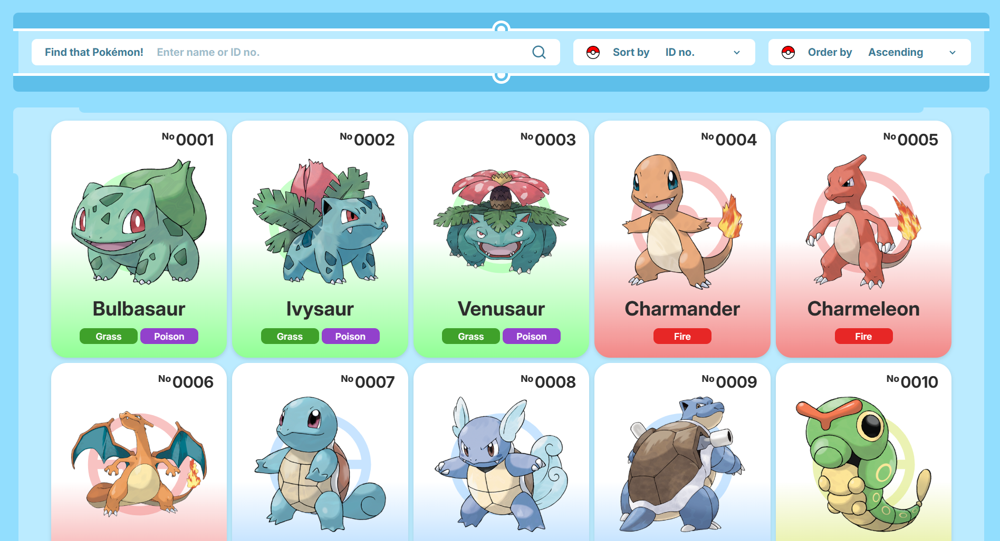
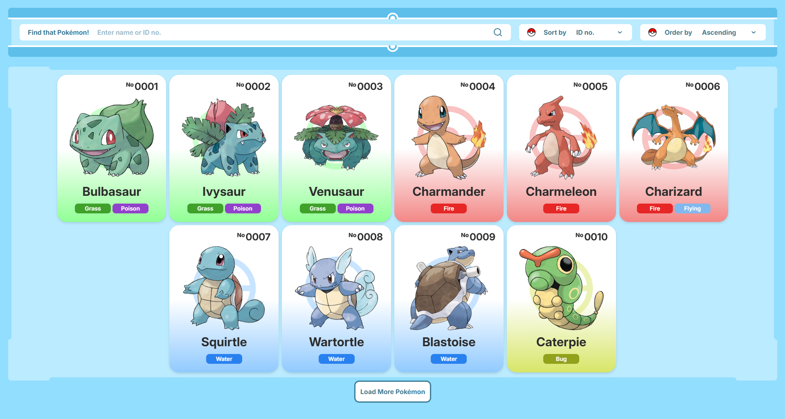

# POKÉDEX Application

This project is a **POKÉDEX**, a simple catalogue webpage where you can list and view details various Pokémon.

All Pokémon information used were sourced from [PokéAPI](https://pokeapi.co/), the RESTful Pokémon API.

## Features
- **View Pokémon:** Browse the Pokémon catalogue.
- **Search Pokémon** Search for specific Pokémon using their name or ID number.
- **Sort Pokémon** Sort Pokémon by their name or ID, in ascending or descending order.
- **Load More Pokémon:** Add more Pokémon to the catalogue, whose information matches the active filters.
- **View Pokémon Details:** View a Pokémon's information by clicking on its card in the catalogue.

## Installation Guide

This guide will help you in installing the POKÉDEX in your local machine.

### Prerequisites
- [Node.js](https://nodejs.org/en)
- npm

### Dependencies
This project was built using:

- [Vite](https://vitejs.dev/) - Fast build tool
- [React](https://react.dev/) - UI library
- [Lucide React](https://lucide.dev/guide/packages/lucide-react) - Icon library
- [Tailwind CSS](https://tailwindcss.com/) - Styling
- [daisyUI](https://daisyui.com/) - Tailwind CSS plugin for components
- [Axios](https://axios-http.com/) - HTTP requests

### Installing
Upon downloading the POKÉDEX project, follow the instructions below:  

#### Step 1: Navigate to the Project
    1. Unzip the compressed file
    2. Navigate to the project's root directory
#### Step 2: Install Dependencies
    1. Open a terminal in the current directory
    2. Install dependencies by running the command:
        npm install
#### Step 3: Start the Application
    1. Launch the application by running the command:
        npm run dev

## Application Previews

## Resources
- [Kalos Region Pokédex Design Reference](https://pin.it/4N8PxANkn)
- [Pokeball Pokemon Catch SVG by SVG Repo](https://www.svgrepo.com/svg/420929/pokeball-pokemon-catch)
- [Pokémon Type Colors](https://bulbapedia.bulbagarden.net/wiki/Type)
- [Pokedex Entry Template by irradiatedsnakes](https://www.reddit.com/r/fakemon/comments/wgz52w/made_a_pokedex_entry_template_from_the_hgss/?rdt=63797)
- [Pokemon Maximum Stat Value Computation by Pokemaster](https://pokemondb.net/pokebase/6506/there-formula-for-working-pokemons-highest-possible-stats)
- [Pokemon Weakness Chart](https://www.eurogamer.net/pokemon-go-type-chart-effectiveness-weaknesses)

## Notes
This is an outdated javascript version.